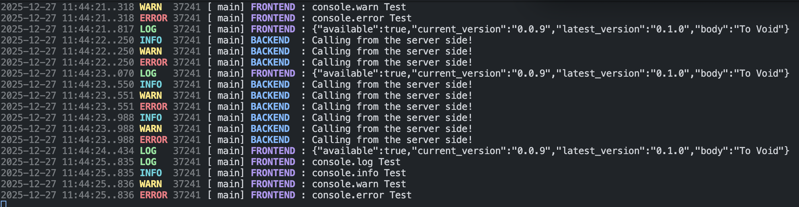
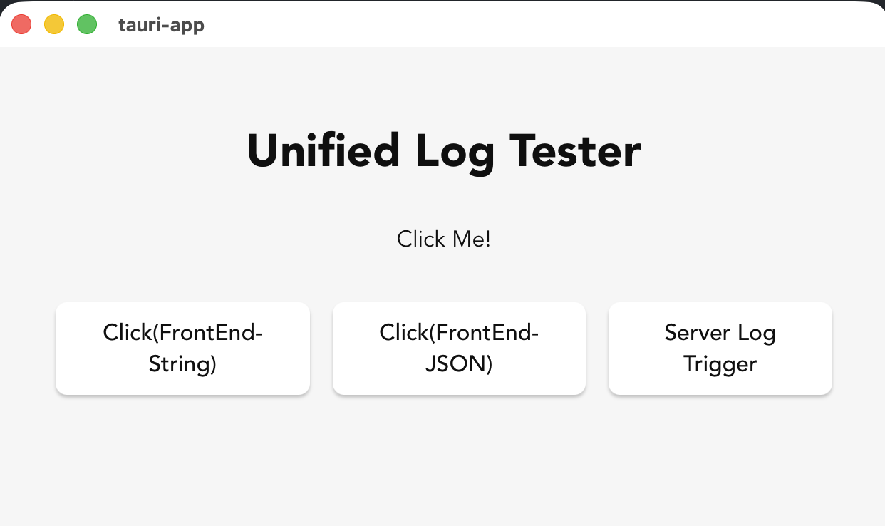

# Tauri Plugin unified-log

Compatibility: Tauri v2.0+ (Stable)


## 💡 Motivation
When developing apps with Tauri, there is one extremely frustrating and blood-pressure-raising(!) point: Disconnected Logging.

Frontend errors must be checked by opening the Browser DevTools (Inspect Element).

Backend (Rust) logs appear separately in the system terminal.

Since these two worlds are isolated, tracing data as it moves from the UI to the backend feels like a nightmare. You have to constantly switch windows and manually compare timestamps, which not only strains your eyes but completely breaks your mental flow. ㅡㅡ

## 🛠 Solution
To solve this pain point, I benchmarked the Java Spring Boot logging style to unify and manage everything within a single terminal.



1. **Unified Logging**: Intercepts Frontend console.log and pipes it instantly to the Rust terminal.

2. **Spring Boot Style Layout**: Sophisticated logging that includes Timestamps, Log Levels (INFO/WARN/ERROR), PID, Thread names/IDs, and Source tags (BACKEND/FRONTEND).

+ Format: [Timestamp] [Level] [PID] [Thread] [Source] : Message
+ Race Condition Tracking: Easily identify which thread reached the log first by checking the precise thread ID/name.
+ Visibility: Monitor the entire application flow at a glance without leaving your terminal. 

3. **Dev-Only Implementation**: Using conditional compilation (debug_assertions), the logging logic is automatically excluded from the production build. No performance overhead, no security leaks in your final product.


---

## 한국어(Korean) Ver

### 왜 만들었나요? (Motivation)

Tauri로 앱을 개발하다 보면 진짜 확인하기 거지같고 혈압 오르던(!) 포인트가 하나 있습니다. 바로 로그의 분리입니다.
프론트엔드 에러는 브라우저 개발자 도구(Inspect Element)를 열어서 봐야 하고,
백엔드(Rust) 로그는 터미널에서 따로 봐야 했습니다.

이 두 세계가 단절되어 있다 보니, 데이터가 프론트에서 백엔드로 넘어가는 과정에서 문제가 생기면 양쪽 창을 번갈아 보며 타임라인을 대조하느라 눈알이 빠질 지경이었고, 뇌의 사고흐름이 엉망으로 꼬이고 있었습니다.ㅡㅡ;

### 어떻게 해결했나요? (Solution)
이 불편함을 해결하기 위해 우리 Java 공화국(Republic of Java)의 Spring Boot의 로깅 스타일을 벤치마킹하여, 터미널 하나에서 모든 것을 관리하도록 만들었습니다.


1. **로그 통합**: 프론트의 console.log를 가로채서 Rust 터미널로 즉시 쏩니다.

2. **Spring Boot Style 레이아웃**: 시간, 로그 레벨(INFO/WARN/ERROR), PID, 쓰레드, 소스출처(BACKEND/FRONTEND)를 정교하게 로깅합니다.

+ [시간] [레벨] [PID] [쓰레드] [소스] : 메시지
+ 경합 상태(Race Condition) 파악: 여러 스레드가 동시에 로그를 찍을 때, 어떤 녀석이 먼저 도착했는지 스레드명을 보고 쉽게 판단할 수 있습니다. 
+ 터미널만 보고 있어도 앱 전체의 흐름(Flow)이 한눈에 보여줍니다.

4. **개발모드에만 적용** : 로그 출력 로직이 컴파일 단계에서 자동으로 제외되게 세팅하였고, 최종 제품의 성능에 영향을 주지 않으며 로그 유출 걱정이 없습니다. 


```shell
2025-12-27 12:05:01.001  INFO 1234 --- [      main] BACKEND         : Tauri App Initialized!
2025-12-27 12:05:05.123 DEBUG 1234 --- [      main] FRONTEND        : Button Clicked
2025-12-27 12:05:05.124  WARN 1234 --- [  thread-2] BACKEND         : Processing Heavy Task...
```

## Example




see **example/tauri-app**


## Getting Started

### 1. Installation

Run the following command in your src-tauri directory:

```shell
cargo add rgbitsoft-tauri-plugin-unified-log
```

Install js package:

```shell
pnpm add @rgbitsoft/tauri-plugin-unified-log
# or
npm install @rgbitsoft/tauri-plugin-unified-log
```


### 2. Setup

#### Step1. Register Plugin(Rust)

> Initialize the plugin in your main.rs or lib.rs:

```rs
use rgbitsoft_tauri_plugin_unified_log;

fn main() {
    tauri::Builder::default()
        .plugin(rgbitsoft_tauri_plugin_unified_log::init())
        .run(tauri::generate_context!())
        .expect("error while running tauri application");
}
```

#### Step2. Configure Permissions

> Tauri 2.0 requires explicit security permissions. Add unified-log:default to your capability configuration (e.g., src-tauri/capabilities/default.json)

```json
{
  "permissions": [
    "core:default",
    "unified-log:default"
  ]
}
```

### Step3. Initialize Frontend (JS/TS)

> Call initUnifiedLog at the entry point of your application:

```ts
import { initUnifiedLog } from "@rgbitsoft/tauri-plugin-unified-log";

// Bridges all browser logs (console.log, warn, error, ..) to the Rust terminal
initUnifiedLog({
   printInBrowser: true,   // Keep logs visible in the browser console
   prettyJson: false       // Set true to format JSON objects for better readability
});
```

### 3. Usage

#### Frontend Logging

> Use the standard Web API. Everything is automatically intercepted and sent to the terminal.

```js
console.log("Hello from Frontend! 🚀");  
console.error("Something went wrong! 😱");
```

#### Backend Logging

> Use the powerful unified_log! macro to maintain the same professional layout on the Rust side.

```rs
use rgbitsoft_tauri_plugin_unified_log::unified_log;

#[tauri::command]
fn trigger_server_log() {
    let current_version = 1.0.0
    unified_log!(Info, "Current Version: v{}", current_version);
    unified_log!(Warn, "Message!");
    unified_log!(Error, "Message!");
}
```

## 🛠 Features

**Unified Stream**: No more switching between browser DevTools and your terminal.

**High Visibility**: Distinctive color coding and layout for immediate recognition.

**Tauri 2.0 Ready**: Built specifically for the latest Tauri ecosystem with full permission support.
